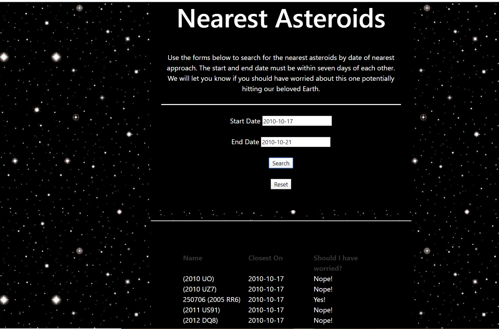
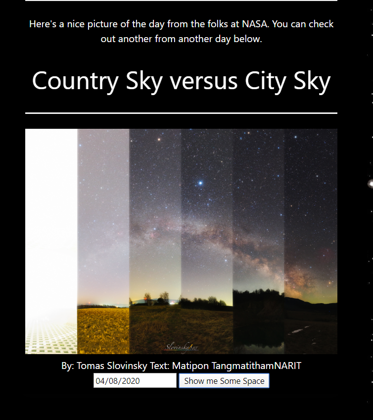
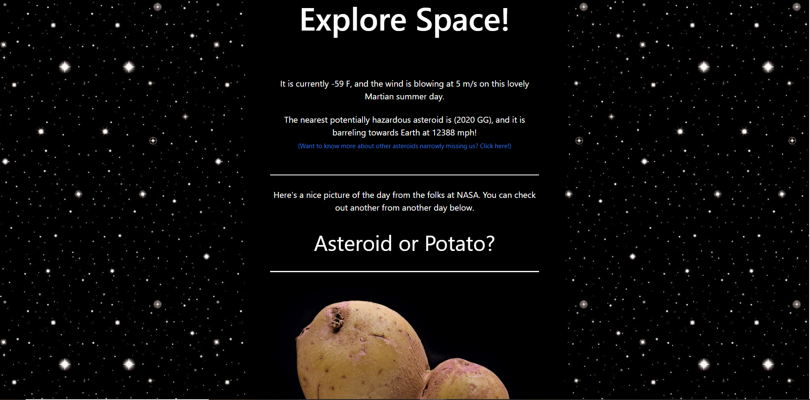

# Explore Space

# Application Requirements

- Must use at least two server-side APIs
- Must use a CSS framework _other than_ Bootstrap
- Must be interactive (i.e: accept and respond to user input)
- Use at least one new third-party API
- Must have a polished UI
- Must meet good quality coding standards
- Does not use alerts, confirms or prompts (look into _modals_)
- Must be deployed to GitHub Pages

# Where it was Started

As this was a group project we started looking at a list of free APIS and discussed which ones seemed interesting and that had a lot to offer. We discovered NASA free APIS and immediately gravitated to the picture of the day API. But alot of other APIS caught our attention. We were told to focus on a one to one basis to ensure quality over quantity.

# Problems that were run into

We ran into a problem with one of our APIS and received the error " jquery.min.js:4 Mixed Content: The page at 'https://bpeart90.github.io/space.io/' was loaded over HTTPS, but requested an insecure XMLHttpRequest endpoint 'http://api.open-notify.org/astros.json'. This request has been blocked; the content must be served over HTTPS."
We did try to fix but to no avail.

This was the first time that all of us had to work on one github. So we ran into some github conflicts. Luckily they were fixable.

# Future Development

As was said earlier there are plenty more free APIS on NASAs website and we would like to add as many to the page as possible. For example we would love to add stages of the moon or a countdown to the next space launch. We would also like to add other pages with more indepth explanations of items(like the asteroid one).

# Pictures

# Link

https://bpeart90.github.io/space.io/
